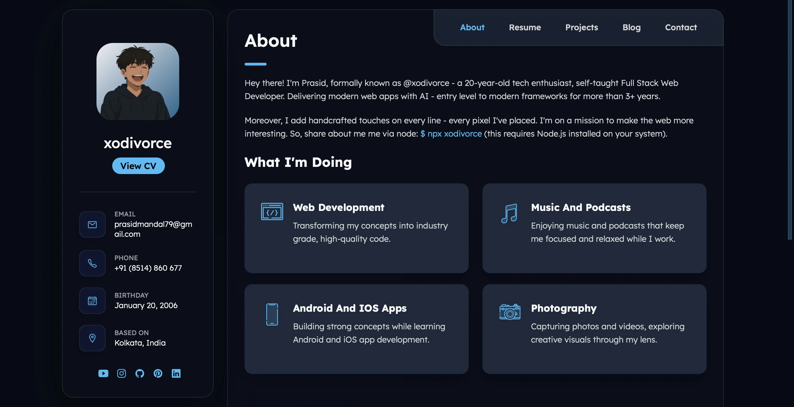

## Xodivorce - Portfolio Website: powered by @xodivorce

### 👀 Preview:


### Official Portfolio Website of Prasid Mandal - Full-Stack Web Developer - (Also Known as @xodivorce).

[](https://github.com/xodivorce/portfolio)
[](https://github.com/xodivorce/portfolio)
[](https://github.com/xodivorce/portfolio)

> **🥰 Like this project? Please consider giving it a Star (🌟) on GitHub to show us your appreciation. Thank you!**

### 🧩 Offical Repositories

[](https://github.com/xodivorce/portfolio)
[](https://gitea.neosubhamoy.com/xodivorce/portfolio)

### ⚡️ Technologies Used


### 🛠️ Installation
Want to get started quickly? Follow the instructions below to install and run the project on your system.

1. **Clone the repository**:
   - Clone the repository to your local machine:
     ```bash
     # Clone using SSH
     git clone git@github.com:xodivorce/portfolio.git
     # Or using HTTPS
     git clone https://github.com/xodivorce/portfolio.git
     ```

2. **Install dependencies**
   - Navigate to the project directory:
     ```bash
     # Using Terminal
     cd portfolio
     ```
   - Install dependencies:
     ```bash
     # Using Terminal
     composer install
     npm install
     ```

3. **Configure Environment & Database**
   - Set up your `.env` file based on `.env.example` file.

   - Generate application key:
     ```bash
     # Using Terminal
     php artisan key:generate
     ```
     
   - Run migrations and seed data:
     ```bash
     # Using Terminal
     php artisan migrate --seed
     ```

4. **Run using Docker (recommended)**
   - Make sure `Docker` is installed, then run:
     ```bash
     # Start Docker Containers
     docker compose up -d
     ```
   - Then run the project via:
     ```bash
     # For Local Development
     composer run dev
     ```

🐞 **Got Ideas or Spotted a Bug?**   
Don’t be shy! [*Open an issue*](https://github.com/xodivorce/portfolio/issues) to discuss new features, enhancements, or any bugs you find. Your feedback is golden!!

> <strong>⚠️ Frequently Asked Questions:</strong>
> <ul>
>   <li><a href="FAQs/FAQ_EN.md" style="color:black;text-decoration:none;">🇺🇸 FAQ in English</a></li>
>   <li><a href="FAQs/FAQ_IN.md" style="color:black;text-decoration:none;">🇮🇳 FAQ हिंदी में</a></li>
>   <li><a href="FAQs/FAQ_RU.md" style="color:black;text-decoration:none;">🇷🇺 ЧаВо на Русском</a></li>
>   <li><a href="FAQs/FAQ_IT.md" style="color:black;text-decoration:none;">🇮🇹 FAQ in Italiano</a></li>
> </ul>

### 📄 License

Xodivorce - Portfolio Website is a fully open sourced project licensed under the [**MIT LICENSE**](LICENSE.txt), but still some parts of this website are not allowed to use or distribute without proper permission or attribution. All the contents (eg: all informations of portfolio, resume, projects, blog, contact) published in this website and the visual components (eg: layout, design, animations, images, graphics) used in this website are not covered under the MIT License and requires special permission to be used. Using these without prior permission will cause legal actions.

> 🧠 Follow me on [Instagram](https://www.instagram.com/xodivorce) or check out more projects at [xodivorce.in](https://www.xodivorce.in)

<br></br>

****

An open sourced project - crafted with 🫀 by **xodivorce**